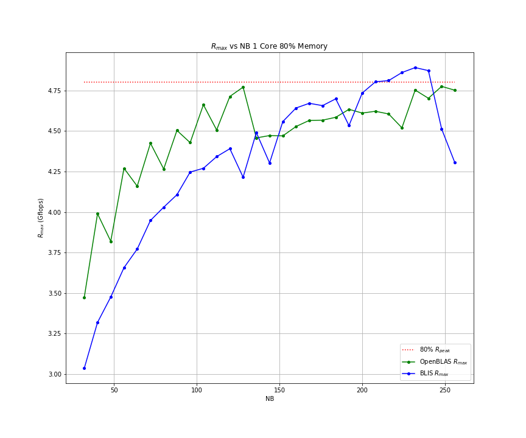
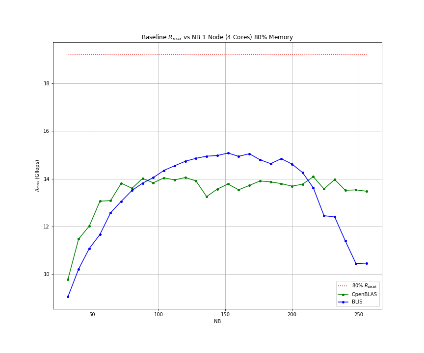
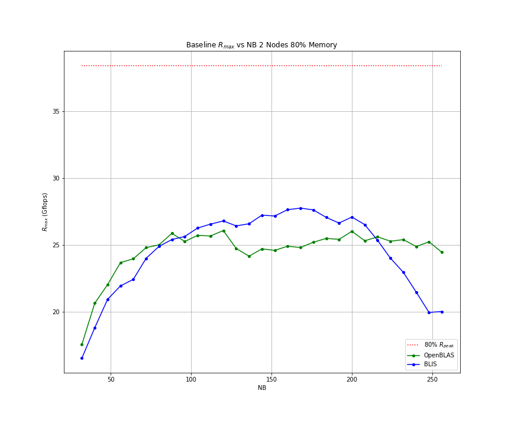
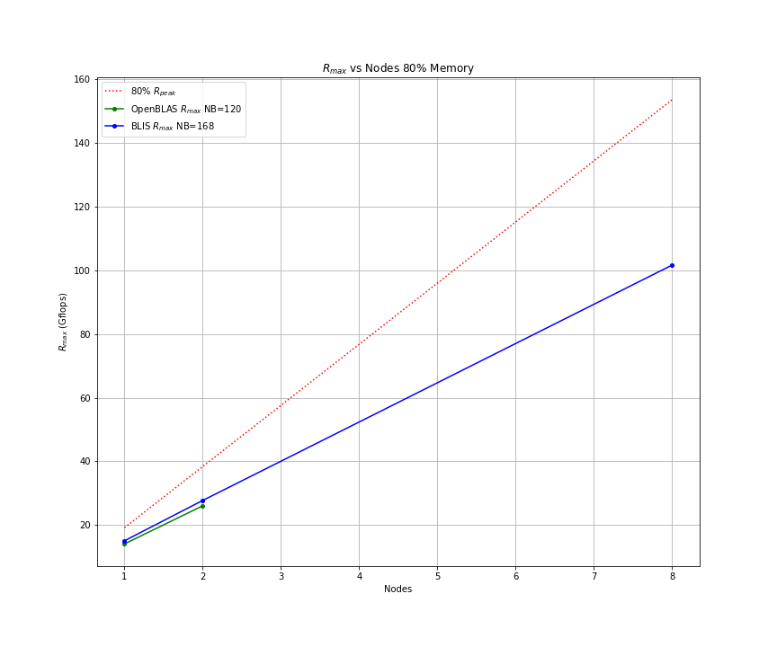

# Raspberry Pi 4 Model B Performance Benchmarks

# Raspberry Pi Specification

* Broadcom BCM2711 SoC
* 1.5GHz Clock
* 4 x Arm Cortex-A72 cores, 64-bit armv8.0-a architecture
* 1 x 128 bit SIMD pipeline per core, capable of 2 floating point operations on 2 doubles per clock cycle using FMA instructions
* 4GB RAM

# Baseline High Performance Linpack (HPL) Benchmarks

## Software

HPL benchmarks Ubuntu 20.04 LTS 64-bit Pre-Installed Server default packages:

* OpenBLAS (serial) 0.3.8
* BLIS (serial) 0.6.1
* OpenMPI 4.0.3

HPL-2.3 built from source with ```-O3 -march=armv8-a -mtune=cortex-a72```

## Theoretical Maximum Performance

The theoretical maximum performance for a single node:

```
Rpeak = 1.5GHz clock * 4 cores * 4 floating point operations per clock cycle
Rpeak = 24 Gflops
```

Using 80% of memory results in a maximum achievable:

```
80% Rpeak = 19.2 Gflops per node
80% Rpeak =  4.8 Gflops per core
```

## Benchmarks

Please note, these are not Problem Size vs Gflops benchmarks. I know in advance that I want to use a problem size which utilises 80% of available memory.

So, for each value of NB, N is selected to be an integer multiple of NB as close as possible to 80% of memory:

```
N = abs(0.8 * sqrt(4 * node_count x 1024^3) / NB) * NB
``` 

### Gflops vs NB 1 Core 80% Memory


### Gflops vs NB 1 Node (4 Cores) 80% Memory


### Gflops vs NB 2 Nodes 80% Memory


### Gflops vs Nodes 80% Memory

Rmax is the maximum observed Gflops using the following values of NB:

* OpenBLAS NB = 120 
* BLIS     NB = 168

These values achieved Rmax on the 2 node benchmark. The assumption that this extrapolates to the 8 node benchmark  needs further investigation.



